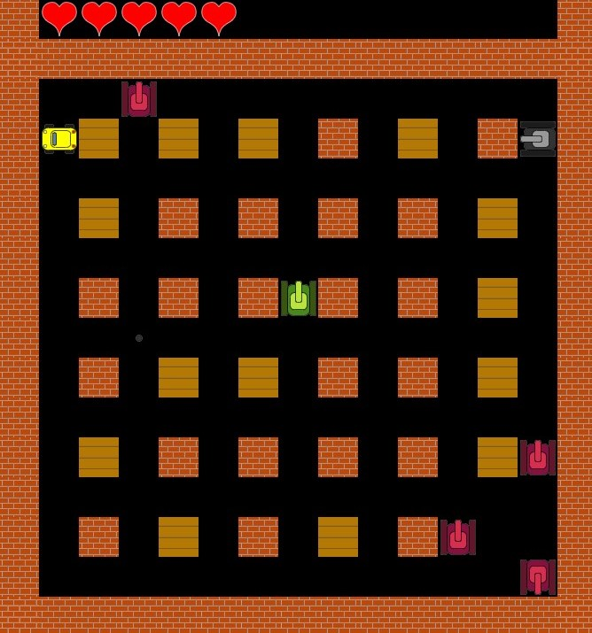
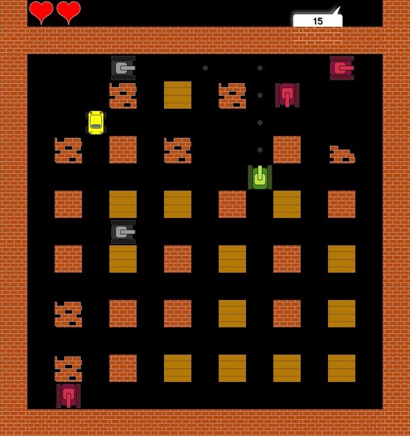

# Battle City

## Equipo de desarrollo

- Chiara Forti Dono
- Pablo Bragoni
- Ezequiel Pedrerol

## Capturas

>

## Reglas de Juego / Instrucciones

- Derrotar a la mayor cantidad de tanques posibles.

Los tanques comunes tienen x vidas y al destruirlos se suman x puntos.

Los tanques pesados tienen x vidas y al destruirlos se suman x puntos.

- Evitar que destruyan a los civiles.

Por cada civil destruido se restan x puntos.

- Llegar a 150 puntos para poder ganar.

## Otros

- Curso/Facultad
- Versión de wollok
- Una vez terminado, no tenemos problemas en que el repositorio sea público / queremos manternerlo privado
